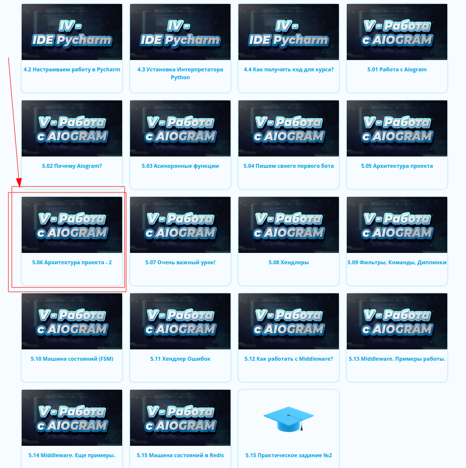

# Шаблон устарел!

**Внимание, данный шаблон имеет множество проблем, поэтому я принял решение его скрыть от пользователей.**

*Если вам все же очень захочется использовать его в своем проекте - можете взять [версию из предыдущего коммита](https://github.com/Latand/aiogram-bot-template/tree/7c151a4077fa5bb33f9feaea454e60265d380995).*

*Использование данного шаблона не рекомендуется по 2-м основным причинам: злоупотребление глобальными переменными и использование импортирования модулей для запуска кода внутри них*

Взамен этому шаблону предлагаю вам [новый шаблон](https://github.com/Latand/tgbot_template), где эти проблемы не встречаются. 

Также, чтобы лучше понять [новый шаблон](https://github.com/Latand/tgbot_template), можете посмотреть специальный урок [на моей образовательной площадке](https://botfather.dev/?utm_source=github_template).
Для просмотра этого урока вам необходимо будет зарегистрироваться на сайте, просмотреть предыдущие уроки. Урок находится в Базовых (бесплатных) уроках.

**P.S. By Tishka17**

Недостатки глобальных переменных:

1. Неконтролируемый доступ. Так как они не передаются явным образом, к ним можно легко получить доступ с помощью из слоев абстракции, которые о них не должны вообще знать. 
   Пример такой ошибки: обращение в БД из html-шаблонов

2. Усложнение использования кода из-за неявных связей. Невозможно глядя на функцию понять, что ей нужно для работы. 
   Например, если мы вызываем функцию foo, а она вызывает функцию bar, а так вызывает функцию baz, которая обращается к глобальной переменной XXX, мы не можем догадаться что XXX надо иницилизировать для использования foo. 
   Это можно документировать, но наличие такой документации невозможно проверять автоматически.

3. Неконтролируемый жизненный цикл. Глобальная переменная существует в глобальном скоупе и соответственно к ней есть доступ ещё на этапе импорта. 
   Соответственно если мы хотим инициализировать её чем-то кроме константы, мы должны контролировать порядок импортов или делать инициализацию так же на этапе импорта. 
   Так же она должна существовать без переприсвоения всё время жизни программы.

4. Сильное сцепление. Так как переменная инициализируется там же откуда её импортируют, в результате косвенно весь код использующий переменную сцеплен с кодом её иницилизации. 
   В результате код использующий такую переменную невозможно использовать не втаскивая конкретный код инициализации.  

5. Невозможность иметь два экземпляра без изменения кода, использующего их. 
   Пример, раньше использовалось одно соединение с БД, но при повышении нагрузки часть запросов решили делать в read-only реплику. 
   В случае DI изменения так же потребуются, но есть возможность выбрать, где будет приниматься решение об использовании конкретного соединения, и не менять контракт использующих его частей.    

6. Все выше сказанное усложняет тестирование кода. 

Кроме того, в зависимости от реализации, часть этих пунктов актуальная и для синглтонов. Так же синглтон отличается сложной реализацией, которая не дает никаких преимуществ по сравнению с глобальными переменными, но может содержать ошибки.

Во всех случаях, когда жизненный цикл переменных не завязан физически на жизненный цикл интерпретатора, стоит воспользоваться концепцией DI. 
Иногда фреймворки предлагают свои механизмы передачи зависимостей, но в этом случае надо следить, чтобы эти механизмы были использованы только в слоях, работающих с фреймворком
